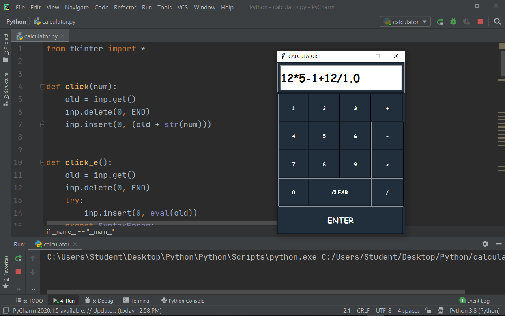

# Treadmill Dashboard

Tools: Python, Tkinter

- Developed a simple GUI application resembling a treadmill display panel dashboard.
- Simulates the interface and functionality of a running treadmill display.

## Demo

https://github.com/user-attachments/assets/92c1d423-11aa-4086-8b5d-f60a35617ab8

## Screenshots

|  |  |
|------------------------------------------|------------------------------------------------------|

## Learning Time

